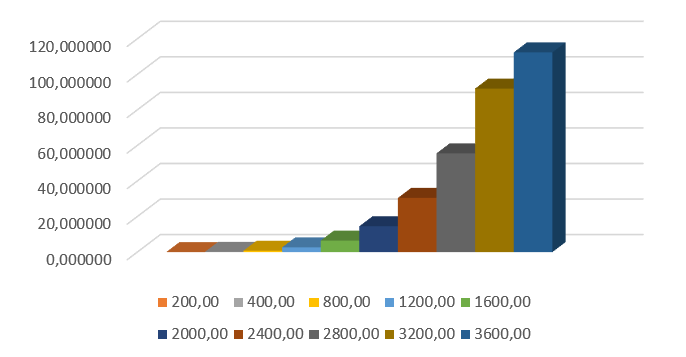

# Paralel_Lab1
# Лабораторная работа №1: Последовательное перемножение матриц

**Студент:** [Жирнов Александр Александрович]  
**Группа:** [6201-120304D]  

---

## 1. Изменения в программе (относительно исходного кода)

1. **Автоматизация экспериментов**  
   Программа теперь сама перебирает размеры матриц (200, 400, …, 4000) и сохраняет время в `timings.txt`.

2. **Файловый вывод с привязкой к размеру**  
   Матрицы сохраняются в файлы `A_<N>.txt`, `B_<N>.txt`, `C_<N>.txt` — это исключает путаницу при обработке разных N.

3. **Повышение точности записи**  
   Использован фиксированный формат вывода (`fixed << setprecision(10)`) для сохранения всех значащих цифр.

4. **Верификация на Python**  
   Написан скрипт, который автоматически проверяет результаты с помощью NumPy и выводит статистику погрешностей.

---

## 2. Ход работы

### 2.1. Создание программы
На языке C++ написана программа, реализующая последовательное умножение квадратных матриц. Для замера времени использован `std::chrono`.

### 2.2. Проведение экспериментов
Запуск программы для размеров N = 200, 400, 800, 1200, 1600, 2000, 2400, 2800, 3200, 3600.  
Для каждого размера получены файлы матриц и зафиксировано время выполнения.

### 2.3. Верификация
В Google Colab запущен Python-скрипт, который обработал все пары файлов и вычислил максимальные абсолютные и относительные ошибки.

---

## 3. Результаты

### Таблица 1. Время выполнения и объём задачи
| N    | Время, с | Объём операций (2·N³) |
|------|----------|------------------------|
| 200  | 0.01177  | 1.60×10⁷               |
| 400  | 0.09778  | 1.28×10⁸               |
| 800  | 0.7733   | 1.02×10⁹               |
| 1200 | 2.644    | 3.46×10⁹               |
| 1600 | 6.474    | 8.19×10⁹               |
| 2000 | 14.53    | 1.60×10¹⁰              |
| 2400 | 30.48    | 2.76×10¹⁰              |
| 2800 | 55.56    | 4.39×10¹⁰              |
| 3200 | 91.99    | 6.55×10¹⁰              |
| 3600 | 112.37   | 9.33×10¹⁰              |

### График зависимости времени от N
  
*Логарифмический масштаб, красная линия – теоретическая зависимость O(N³).*

### Таблица 2. Погрешность вычислений (для размеров до 2000)
| N    | Макс. абсолютная ошибка | Макс. относительная ошибка |
|------|-------------------------|----------------------------|
| 200  | 1.66×10³                | 9.20×10⁻⁷                  |
| 400  | 3.69×10⁴                | 1.70×10⁻⁶                  |
| 800  | 7.54×10⁵                | 2.27×10⁻⁶                  |
| 1200 | 4.72×10⁶                | 2.49×10⁻⁶                  |
| 1600 | 1.84×10⁷                | 2.28×10⁻⁶                  |
| 2000 | 4.82×10⁷                | 2.50×10⁻⁶                  |

*Для всех размеров относительная ошибка не превышает 3×10⁻⁶, что подтверждает корректность вычислений.*

---

## 4. Вывод

- Экспериментально подтверждена кубическая сложность алгоритма: при увеличении N в 10 раз время выполнения растёт примерно в 1000 раз.
- Относительная погрешность остаётся стабильно малой (< 3×10⁻⁶) для всех размеров, что говорит о правильности реализации.
- Автоматическая верификация с помощью Python и NumPy полностью подтвердила результаты программы.
- Все требования лабораторной работы выполнены.

---

## 5. Приложение

- [Исходный код на C++](code/matmul.cpp)
- [Скрипт верификации на Python](code/verify.py)
- [Файл с замерами времени](results/timings.txt)
- [Примеры матриц](results/) (при необходимости)
